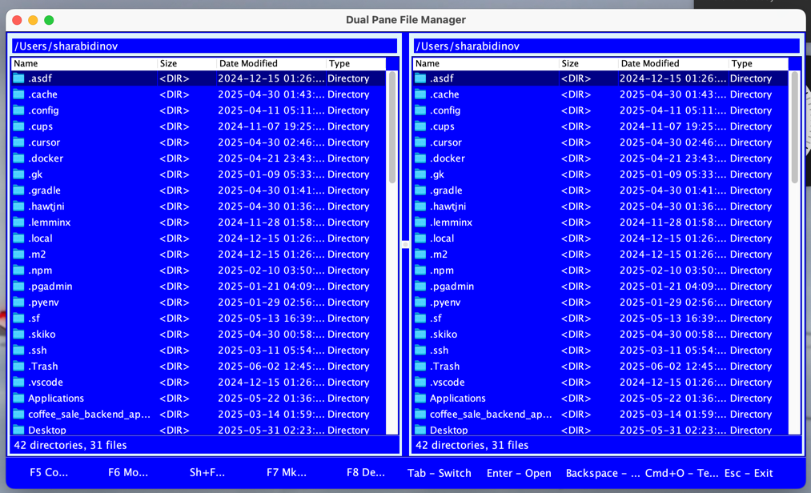

# Dual Pane File Manager

A dual pane file manager inspired by classic programs like Far Manager and Midnight Commander. This project is a desktop Java application with a graphical user interface that allows efficient file and directory management.



## Features

- **Dual-pane interface** - work with two directories simultaneously
- **Classic blue interface** - a nostalgic style reminiscent of Far Manager and Midnight Commander
- **Convenient keyboard shortcuts** - quick access to core functions
- **Complete set of file operations**:
  - Copy files and directories (F5)
  - Move files and directories (F6)
  - Rename files and directories (Shift+F6)
  - Create new directories (F7)
  - Delete files and directories (F8)
- **Easy directory navigation**
- **Built-in terminal integration** (Cmd+O)

## Requirements

- Java Runtime Environment (JRE) 17 or higher
- Graphical environment for running the desktop application

## Running the Application

```bash
java -jar dual-pane-file-manager.jar
```

## Keyboard Shortcuts

| Key | Action |
|-----|--------|
| Tab | Switch between panels |
| Enter | Open file/directory |
| Backspace | Navigate to parent directory |
| F5 | Copy file/directory |
| F6 | Move file/directory |
| Shift+F6 | Rename file/directory |
| F7 | Create new directory |
| F8 | Delete file/directory |
| Cmd+O | Open terminal in current directory |
| Esc | Exit application |

## Project Structure

- **Main.java** - entry point for the application, initializes components
- **Model.java** - data model, handles file operations
- **Viewer.java** - graphical interface, file system display
- **Controller.java** - user action processing logic

## Architecture

The project follows the MVC (Model-View-Controller) design pattern:

- **Model** (Model.java) - manages file system operations, performs copy, delete, etc.
- **View** (Viewer.java) - graphical interface with two panels displaying directory contents
- **Controller** (Controller.java) - processes user actions and connects Model and View

## Implementation Details

- Uses Java Swing for creating the graphical interface
- Works with files through standard Java libraries (java.io.File, java.nio)
- Supports directory operations (recursive copying/deletion)
- Features an adaptive interface with active panel highlighting
- Platform-independent code that works on Windows, macOS, and Linux

## Building from Source

To build the project from source, you need JDK 17 or higher:

```bash
javac *.java
touch MANIFEST.MF
// You have to enter next value to MANIFEST.MF via text editor
// Main-Class: Main
jar cvfm dual-pane-file-manager.jar Manifest. *.class
```

## License

This project is distributed under the MIT License. See the LICENSE file for more information.
